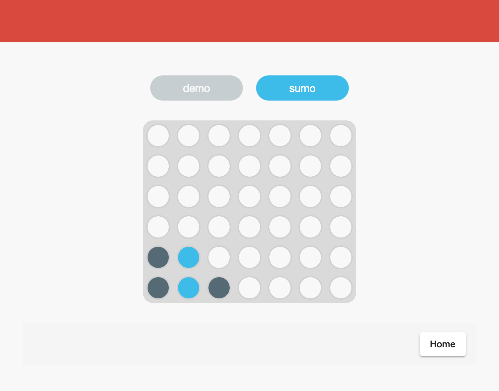
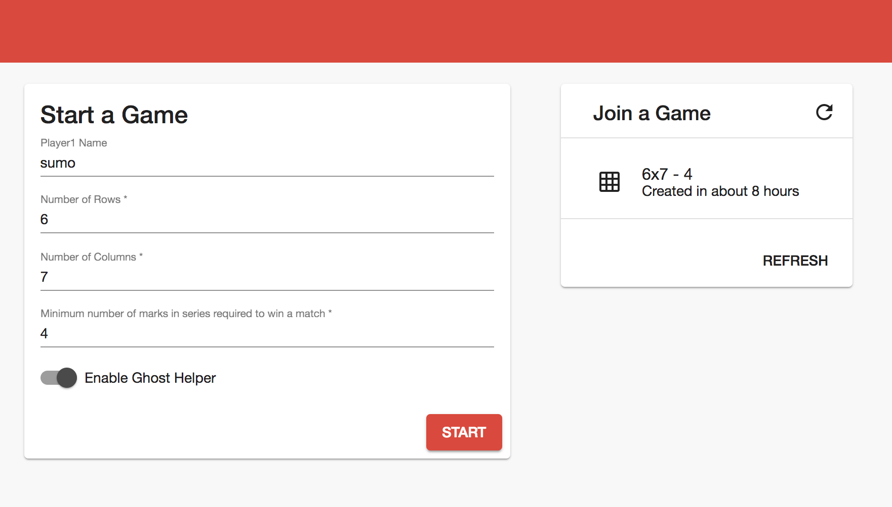

# Connect 4

Connect 4 is a multiplayer board game implemented with **Angular** and **NodeJS** 

Showcase **state** synchronization between players and backend using [CQRS](https://martinfowler.com/bliki/CQRS.html) pattern powered by [NGXS](https://ngxs.gitbook.io/ngxs) and [Socket.IO](https://socket.io/)

* Frontend - *Angular*
* Backend - [NestJS](https://nestjs.com/)
* Database - *PostgreSQL*

## Quick Start
```bash
docker-compose up postgres
ng serve api
ng serve webapp
```

### URLs

* API: http://localhost:3000/api
* API WebSocket: ws://localhost:3000/eventbus
* API Docs: http://localhost:3000/docs
* WebApp: http://localhost:4200


[](https://youtu.be/vLRkDdEW7ZI "Connect 4 Game - Click to Watch!")


